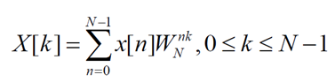
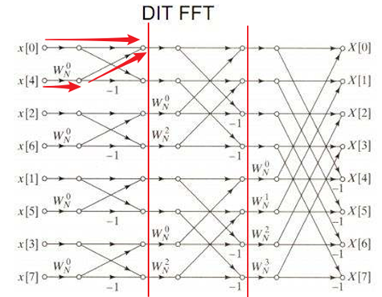
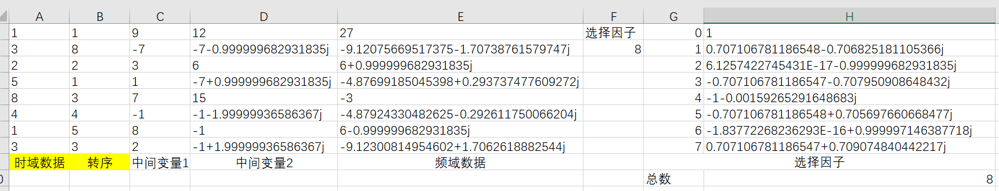

# 离散傅里叶变换实验
分享两篇文章
- [FFT并且有举例(笔算)](https://www.cnblogs.com/kingstacker/p/11175860.html)
- [单独讲DFT](https://www.zhihu.com/question/21314374/answer/542909849)

先从DFT(离散傅里叶变换)说起，公式如下

其中`WN(nk)`自然对数指数函数,分解正弦余弦形式,`Wn = cos(2*pi*n/N) - i*sin(2*pi*n/N)`,(注意有个负号)

固然存在一些特征,例如周期性,奇偶性等待.故可以减少计算量的规律存在。

参考蝶形图

excel计算实验如下:

